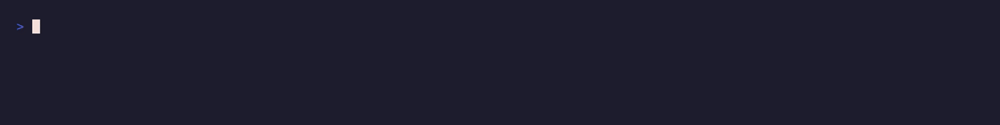

<div align="center">

# dotfiles

**My AI-agent setup and Linux workstation, as code.**

[AI harness config](ai-harnesses/README.md) · [Global agent rules](ai-harnesses/AGENTS.md) ·
[Apps](docs/apps.md) · [Shell](docs/shell.md) · [Sync](docs/sync.md) ·
[Host limits](docs/host-limits.md) · [Development](docs/development.md)



</div>

I run several AI coding agents at once, in Claude Code, OpenCode and DSH (a DeepSeek harness).
Their rules, skills, agents and settings are written once, in `ai-harnesses/`, and
`deno task ai` renders them into the format each harness reads. `deno task ai --check`, shown
above, writes nothing: it compares what every harness on this machine reads with what is
committed, and exits 1 if they differ.

The rest of the repository is the workstation those agents run on: the apps, the shell, the
config files synced into my home directory, and the kernel and systemd limits a dozen parallel
agent sessions need. It is this machine's live config: a merged change is not done until it
is applied here.

## The AI-agent setup

- **One rules file, every harness.** [`ai-harnesses/AGENTS.md`](ai-harnesses/AGENTS.md) holds
  the global rules: autonomy, Git flow, secrets, cleanup, subagent orchestration. It becomes
  Claude Code's `CLAUDE.md` and OpenCode's and DSH's `AGENTS.md`, byte for byte.
- **Agents and skills, written once.** [The agents](ai-harnesses/agents/) and
  [skills](ai-harnesses/skills/) in one harness-neutral format. Validated frontmatter picks a
  model tier and effort per agent; each adapter renders its harness's format, covered by golden
  tests.
- **A reviewer gate.** A separate, read-only [reviewer](ai-harnesses/agents/reviewer.md) runs
  the checks itself, breaks the code to prove each test goes red, and counts every claim in the
  PR body. Its verdict is what authorises a merge.
- **Nothing left running.** [`tools/sweep-orphans.sh`](tools/sweep-orphans.sh) lists the
  processes an agent session left behind, and kills exactly those on request. The rules cap
  the processes and memory of anything that spawns processes, and give every wait a deadline.
- **Costs you can see.** [`tools/session-cost.ts`](tools/session-cost.ts) reports each session's
  and subagent's cost, peak context and compactions from Claude Code's transcripts.
- **Secrets stay local.** Committed env files are age-encrypted one value per line, and
  [`tools/env-key-copy.ts`](tools/env-key-copy.ts) gives a worktree its key without the key
  ever being printed.

How the rendering works, the file layout per harness and how to write a skill or an agent:
[ai-harnesses/README.md](ai-harnesses/README.md).

## The workstation

- **Apps.** [`install-apps.ts`](docs/apps.md) installs everything in `apps.jsonc` with dnf, apt
  or zypper, and falls back to Flatpak.
- **Shell.** [`install-shell.ts`](docs/shell.md) sets up Zsh, Oh My Zsh, Powerlevel10k and the
  aliases in `aliases.sh`.
- **Config in home.** tmux, Neovim, Zsh and the prompt are [symlinked](docs/sync.md) from this
  repository.
- **Limits for many agents.** [`system/`](docs/host-limits.md) raises inotify instances and zram
  swap, cleans `/tmp` sooner, and caps the tasks each app can start.
- **Synced, not cloned.** The repository lives in a Syncthing folder, and agent worktrees are
  [ignored](docs/host-limits.md) so they never replicate.

**Use it if** you want a working example of one rules source driving several AI coding agents,
or a Linux workstation set up by script. **Skip it if** you want a framework: these are my own
settings, not a configurable product.

## Quick start

```bash
curl -fsSL https://deno.land/install.sh | sh   # install Deno
git clone https://github.com/spy4x/dotfiles && cd dotfiles
deno task install-all      # apps, then the shell
deno task ai --check       # compare your harness homes with ai-harnesses/, write nothing
```

`deno task ai` without `--check` replaces the global rules, skills and agents of every installed
harness with mine, and merges my settings into theirs. Read
[ai-harnesses/README.md](ai-harnesses/README.md) first.

## Development

```bash
deno task test             # adapter golden files, engine, tools
deno task ai --check       # exit 1 if any harness differs from ai-harnesses/
```

File layout, adding apps and the encrypted env file: [development.md](docs/development.md).

## Built by

I'm [Anton Shubin](https://antonshubin.com), a senior full-stack engineer and tech lead. This is
how I run AI agents on real work, on my own machine. Need something like it built for your
product? [That's my day job →](https://antonshubin.com)

---

Made by Anton Shubin · [antonshubin.com/tools](https://antonshubin.com/tools)
